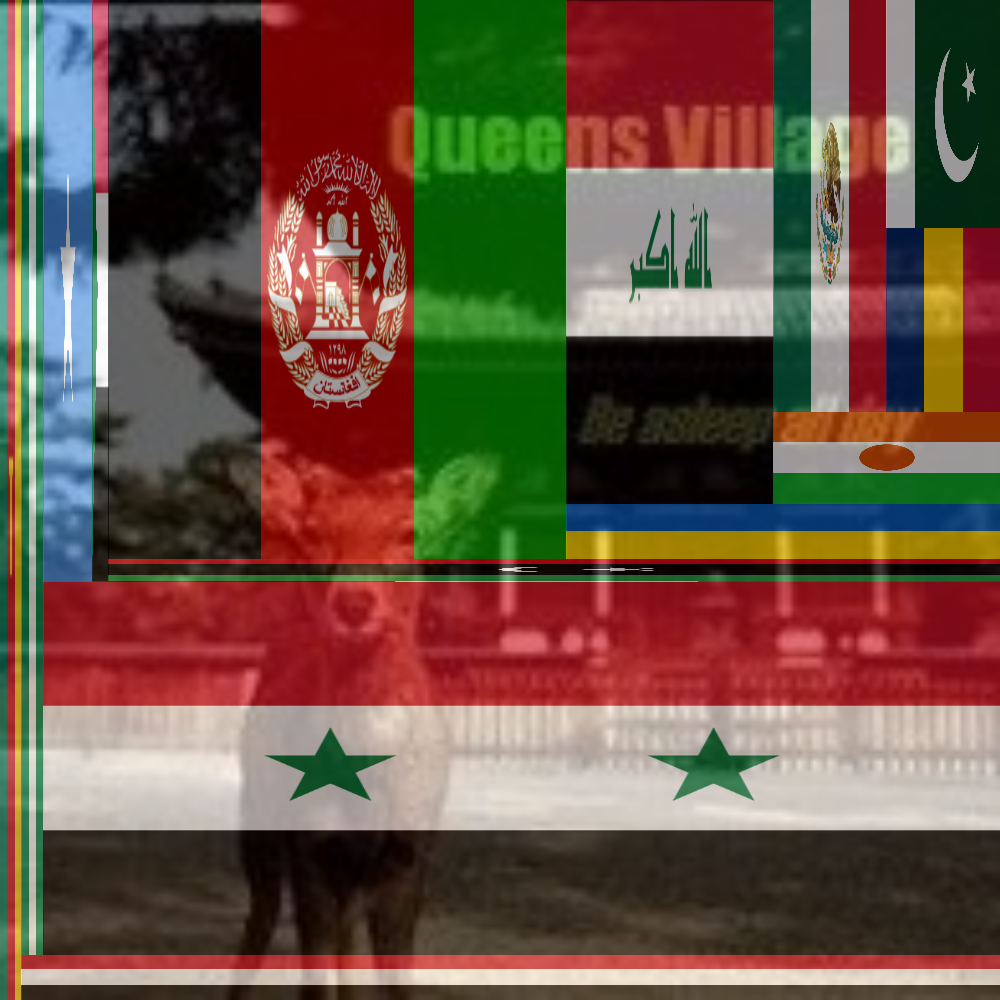

# Become a true worrior!

End terrorism now by changing you profile picture. This tool helps you to do it in a bit more realistic way. Numbers taken from 
from https://en.wikipedia.org/wiki/List_of_ongoing_armed_conflicts 

The algorithem is inspired by: http://scipy-cookbook.readthedocs.org/items/Matplotlib_TreeMap.html

Usage:

    $ python flags.py profile.jpg

Example:

Disclaimer:

I got lazy at some point and included only 14 conflicts plus France. Take this with a pound of salt!
